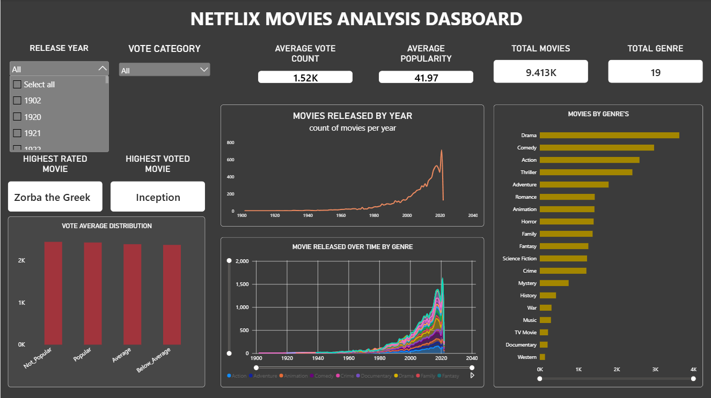

# NETFLIX-MOVIE-ANALYSIS
Netflix Movies Data Analysis using Python, MySQL, and Power BI. Includes data cleaning, exploratory data analysis, SQL queries, and an interactive Power BI dashboard.

🎬 Netflix Movies Analysis

A Data Analytics project focused on analyzing Netflix movie data using Python, SQL, and Power BI. The project explores movie trends, ratings, popularity, genres, and release patterns to generate meaningful insights through data analysis and visualization.

📌 Overview

--The goal of this project is to analyze Netflix movie data and identify useful patterns and trends.

--The project follows a complete data analytics workflow:

--Data Loading → Data Cleaning → Exploratory Data Analysis → SQL Analysis → Power BI Dashboard**

📂 Dataset

The dataset contains information about Netflix movies, including:

- Movie Title
- Genre
- Popularity
- Release Date
- Vote Average
- Vote Count

The dataset was loaded and processed using Python before performing further analysis.

🛠️ Tools & Technologies

- **Python**
  - Pandas
  - NumPy
  - Matplotlib
  - Seaborn

  SQL
  MySQL

  Power BI
  - Data Visualization
  - Interactive Dashboard
  - KPIs
  - Charts and Filters

  Jupyter Notebook

🔄 Project Workflow

1. Data Loading

The dataset was imported into Python using Pandas for further analysis.

2. Data Cleaning

The dataset was checked and cleaned by:

- Handling missing values
- Checking duplicate records
- Checking data types
- Removing unnecessary data
- Preparing data for analysis

3. Exploratory Data Analysis (EDA)

EDA was performed to understand:

- Movie release trends
- Popularity distribution
- Movie genres
- Vote averages
- Number of movies released over time
- Relationship between popularity and ratings

4. SQL Analysis

SQL queries were written in MySQL to answer analytical questions and extract useful insights from the dataset.

Examples include:

- Finding the most popular movies
- Finding movies with the highest ratings
- Analyzing movies by genre
- Analyzing movie release trends
- Comparing popularity and ratings

5. Power BI Dashboard

An interactive Power BI dashboard was created to present the analysis visually.

The dashboard includes:

- Total Movies KPI
- Average Popularity KPI
- Average Vote Rating KPI
- Movies Released by Year
- Movies by Genre
- Vote Average Distribution
- Movie Insights
- Interactive filters

📊 Dashboard

The Power BI dashboard provides an interactive view of Netflix movie data.

Users can explore movie trends based on different categories such as:

- Year
- Genre
- Vote Category

Dashboard Features

- KPI cards
- Bar charts
- Distribution charts
- Movie insights
- Interactive slicers
- Year-wise analysis
- Genre-wise analysis

💡 Key Insights

The project helps identify:

- Which genres have the most movies
- How movie releases have changed over the years
- Which movies have the highest popularity
- Distribution of movie ratings
- Popularity patterns across different movies
- Trends in Netflix movie data
